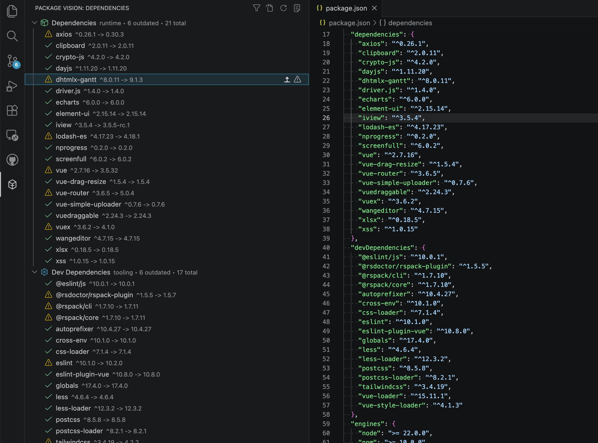
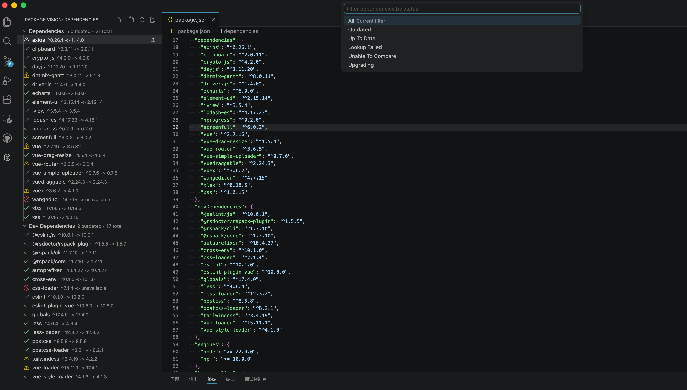
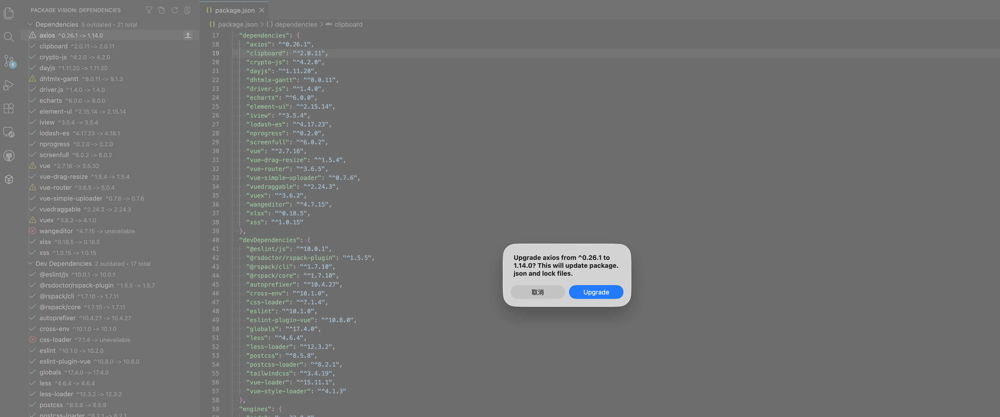

# Package Vision

Package Vision 把依赖巡检和单包升级带到 VS Code 左侧栏。

它适合在日常维护前端项目时，快速查看 `package.json` 里的声明版本、npm registry 上的最新版本，以及哪些包值得优先处理。

已发布到 VS Code Marketplace：

- https://marketplace.visualstudio.com/items?itemName=zongpengz.package-vision

## 安装

1. 在 VS Code 扩展市场搜索 `Package Vision`
2. 或直接打开 Marketplace 页面安装

## 功能亮点

- 在 Activity Bar 提供独立入口
- 扫描当前工作区中的一个或多个 `package.json`
- 展示 `dependencies` / `devDependencies` 的声明版本和最新版本
- 用状态图标区分已最新、过时、查询失败、无法比较和升级中
- 支持按状态快速筛选依赖
- 支持升级单个依赖到最新版本
- 支持配置升级后的版本范围写回策略：`preserve`、`caret`、`tilde`、`exact`
- 提供输出日志，方便定位升级过程中的问题

## 当前支持范围

- 包管理器：`npm`、`pnpm`、`yarn`、`bun`
- 工作区类型：单 package 项目、monorepo / 多个 `package.json`
- 依赖类型：`dependencies`、`devDependencies`

## 使用方式

1. 在 VS Code 左侧打开 `Package Vision`
2. 查看依赖的声明版本、最新版本和状态
3. 需要时用顶部筛选按钮快速缩小范围
4. 点击过时依赖，确认后执行升级

## Screenshots

## 设置项

当前提供一个设置项：

- `packageVision.upgrade.versionRangeStyle`

可选值：

- `preserve`
- `caret`
- `tilde`
- `exact`

这个设置决定升级后写回到 `package.json` 的版本范围风格。

## 开发与文档

如果你是这个仓库的维护者，或者想通过这个项目学习 VS Code 扩展开发，建议从这些文档开始：

- [产品需求文档](./docs/product-requirements.md)
- [技术设计文档](./docs/technical-design.md)
- [开发流程文档](./docs/development-workflow.md)
- [测试与验证文档](./docs/testing-and-validation.md)
- [Marketplace 发布文档](./docs/marketplace-publishing.md)

## 发布状态

`0.0.1` 已于 `2026-04-04` 发布到 VS Code Marketplace。
