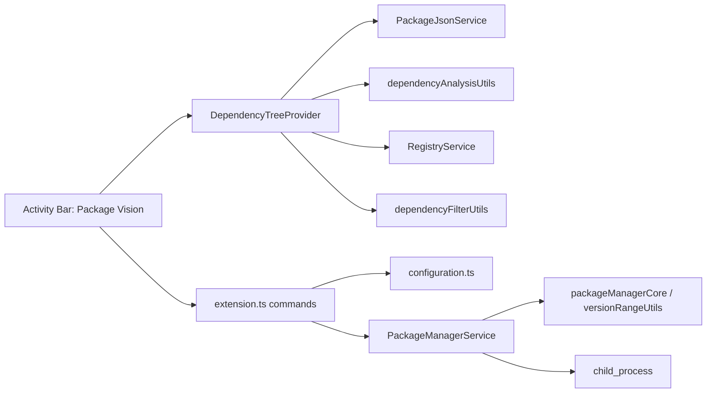

# 技术设计文档

## 1. 设计目标

这个扩展的技术设计要同时满足两件事：

- 对用户来说，依赖查看、筛选和升级动作要直观
- 对开发者来说，结构要清晰，适合新手逐步理解和扩展

因此当前实现仍然优先选择 VS Code 原生能力，而不是一开始就堆复杂 UI。

## 2. 核心技术决策

### 2.1 使用桌面版 Node Extension，而不是 Web Extension

原因很直接：升级依赖需要执行本地包管理器命令，例如 `npm install react@latest`。Web Extension 运行在浏览器 Worker 环境中，无法创建子进程或运行可执行文件，因此不适合作为这个项目的第一实现目标。

### 2.2 使用 Activity Bar 自定义入口

你提到的“和搜索框、插件这些平级”，在 VS Code 里对应的是：

- `Activity Bar` 中的一个自定义 `View Container`

这意味着我们需要在扩展的 `package.json` 中使用：

- `contributes.viewsContainers.activitybar`
- `contributes.views`

### 2.3 使用 Tree View 作为第一版 UI

当前版本继续使用 `Tree View`，理由是：

- 原生集成度高
- 风格和 VS Code 内置视图一致
- 适合 package / section / dependency 的树状结构
- 对新手更容易上手
- 足以承载刷新、悬浮行内操作、右键菜单、筛选、单包升级等操作

即使已经加入快速筛选，这一版仍然可以稳定地用 `Tree View` 承载，不需要为了筛选就切到 `WebviewView`。

## 3. 总体架构



## 4. 当前目录结构

```text
package-vision/
  eslint.config.mjs
  src/
    extension.ts
    configuration.ts
    models/
      dependency.ts
    services/
      dependencyAnalysisUtils.ts
      packageJsonService.ts
      packageManifestUtils.ts
      registryService.ts
      registryUtils.ts
      upgradeStrategyUtils.ts
      packageManagerService.ts
      packageManagerCore.ts
      versionRangeUtils.ts
    views/
      dependencyTreeProvider.ts
      dependencyFilterUtils.ts
  tests/
    dependencyAnalysisUtils.test.ts
    dependencyFilterUtils.test.ts
    packageManagerCore.test.ts
    packageManifestUtils.test.ts
    registryUtils.test.ts
    upgradeStrategyUtils.test.ts
    versionRangeUtils.test.ts
  src/test/
    runTest.ts
    suite/
      extension.integration.test.ts
    fixtures/
      monorepo/
  resources/
    package-vision.svg
  docs/
    codebase-guide.md
    marketplace-publishing.md
    marketplace-release-checklist.md
    product-requirements.md
    release-0.2.0-plan.md
    technical-design.md
    development-workflow.md
    testing-and-validation.md
  tsconfig.tests.json
```

## 5. 模块职责

### 5.1 `extension.ts`

负责：

- 扩展激活入口
- 创建 Tree View
- 注册命令
- 同步视图标题栏状态，例如筛选标签和搜索关键词

不要负责：

- 直接解析 `package.json`
- 直接请求 registry
- 直接拼接所有包管理器命令

### 5.2 `packageJsonService.ts`

负责：

- 扫描工作区中的多个 `package.json`
- 读取和解析 `package.json`
- 提取 `dependencies`、`devDependencies`
- 更新指定依赖的版本声明

### 5.3 `packageManifestUtils.ts`

负责：

- 组装 `PackageManifestRecord`
- 把 manifest 展开成统一的依赖记录
- 做路径标准化

### 5.4 `registryService.ts`

负责：

- 根据包名查询最新版本
- 处理请求失败、超时、缓存
- 控制并发，避免瞬间打出过多请求

### 5.5 `dependencyAnalysisUtils.ts`

负责：

- 在多个 package manifest 之间聚合同名依赖
- 识别声明版本是否出现版本分裂
- 给依赖补上可供视图层使用的 drift 元信息

### 5.6 `registryUtils.ts`

负责：

- 计算依赖是 `upToDate`、`outdated` 还是 `unknown`
- 抽出与 semver 相关的纯逻辑，方便测试

### 5.7 `packageManagerService.ts`

负责：

- 识别项目包管理器
- 计算执行上下文
- 执行升级命令
- 根据设置项改写版本范围
- 触发锁文件同步
- 输出日志

### 5.8 `packageManagerCore.ts`

负责：

- 构造不同包管理器的升级命令
- 构造锁文件同步命令
- 根据目标版本生成明确的升级命令
- 处理 monorepo / workspace 路径相关纯逻辑

### 5.9 `upgradeStrategyUtils.ts`

负责：

- 计算“当前 major 内可安全升级到哪个版本”
- 生成默认展示目标版本
- 组装大版本升级时的候选操作
- 计算当前可见依赖中的批量保守升级候选集

### 5.10 `configuration.ts`

负责：

- 读取 VS Code 配置项
- 为升级逻辑提供大版本升级策略和版本范围策略

### 5.11 `versionRangeUtils.ts`

负责：

- 解析当前声明版本的保存风格
- 根据配置项生成新的版本范围
- 处理 `preserve / caret / tilde / exact`

### 5.12 `dependencyTreeProvider.ts`

负责：

- 将依赖数据转换成 Tree Item
- 管理刷新
- 管理筛选状态
- 管理搜索状态
- 提供空状态提示
- 为过时依赖提供悬浮行内操作
- 提供“当前可见依赖”给批量升级命令复用
- 与命令层联动

### 5.13 `dependencyFilterUtils.ts`

负责：

- 根据依赖状态和搜索关键词做快速筛选
- 输出筛选标签文案

## 6. 数据模型

```ts
export type DependencySection = "dependencies" | "devDependencies";

export interface PackageManifestRecord {
  id: string;
  packageJsonPath: string;
  packageDirPath: string;
  displayName: string;
  relativeDirPath: string;
}

export interface DependencyRecord {
  name: string;
  section: DependencySection;
  declaredVersion: string;
  packageManifest: PackageManifestRecord;
  latestVersion?: string;
  latestSafeVersion?: string;
  hasMajorUpdate?: boolean;
  hasVersionDrift?: boolean;
  status: "unknown" | "upToDate" | "outdated" | "error";
  errorMessage?: string;
}
```

当前实现围绕 `DependencyRecord + PackageManifestRecord` 展开，这样在 monorepo 里可以明确知道依赖属于哪个 package。

## 7. 激活与数据流

推荐按下面的顺序理解当前数据流：

1. 用户点击 Activity Bar 中的 `Package Vision`
2. VS Code 激活扩展
3. 扩展扫描工作区中的 `package.json`
4. 解析依赖列表
5. 查询每个依赖的最新版本
6. 在 monorepo 场景下补充版本分裂分析
7. 根据当前筛选条件和搜索关键词过滤结果
8. Tree View 渲染结果
9. 用户点击单包升级，或执行批量保守升级
10. 执行包管理器命令
11. 按设置项改写版本范围并同步锁文件
12. 成功后刷新视图

## 8. 扩展清单中的关键贡献点

在 `package.json` 中，当前重点使用这些 contribution points：

- `contributes.viewsContainers.activitybar`
- `contributes.views`
- `contributes.commands`
- `contributes.menus`
- `contributes.configuration`

### 8.1 视图容器

用于在 Activity Bar 增加新的入口。

### 8.2 视图

用于把依赖列表挂到这个容器里。

### 8.3 命令

用于刷新、筛选、搜索、批量保守升级、打开 `package.json`、查看输出等操作。

### 8.4 菜单

用于把命令挂到：

- 视图标题工具栏
- Tree Item 悬浮行内操作
- Tree Item 右键菜单

### 8.5 配置项

当前已经用于控制大版本升级策略和升级后的版本范围写回策略：

- `ask`
- `safe`
- `latest`

- `preserve`
- `caret`
- `tilde`
- `exact`

## 9. UI 方案

### 9.1 视图结构

多 package 项目：

- `apps/web`
  - `Dependencies`
    - `react`
  - `Dev Dependencies`
    - `vite`

单 package 项目：

- `Dependencies`
  - `react`
- `Dev Dependencies`
  - `typescript`

### 9.2 Tree Item 展示策略

package 项：

- `label` 使用 package 名或目录名
- `description` 展示位置和依赖数量

分组项：

- `label` 使用分组名
- `description` 展示总量、过时数量、版本分裂数量或升级中数量

依赖项：

- `label`：包名
- `description`：声明版本和当前默认升级目标，例如 `^2.0.0 -> 2.5.4`
- `tooltip`：显示 package、位置、状态、默认升级目标、版本分裂详情，以及更高 major 可用提示
- `iconPath`：使用彩色状态图标区分已最新、过时、失败和升级中

### 9.3 命令建议

当前命令包括：

- `packageVision.refresh`
- `packageVision.setFilter`
- `packageVision.clearFilter`
- `packageVision.setSearch`
- `packageVision.clearSearch`
- `packageVision.upgradeDependency`
- `packageVision.upgradeDependencyToLatestMajor`
- `packageVision.upgradeSafeDependencies`
- `packageVision.openPackageJson`
- `packageVision.showOutput`

## 10. 包管理器策略

### 10.1 识别规则

当前实现通过锁文件向上查找判断：

- `pnpm-lock.yaml` -> `pnpm`
- `yarn.lock` -> `yarn`
- `bun.lock` / `bun.lockb` -> `bun`
- `package-lock.json` -> `npm`
- 其他 -> 默认按 `npm` 处理

### 10.2 升级命令示例

- npm：`npm install <pkg>@<targetVersion>`
- pnpm：`pnpm add <pkg>@<targetVersion>`
- yarn modern：`yarn up <pkg>@<targetVersion>`
- yarn classic：`yarn upgrade <pkg>@<targetVersion>`
- bun：`bun add <pkg>@<targetVersion>`

注意：当前实现已经通过配置项统一最终写回到 `package.json` 的版本范围，并在必要时再次执行安装同步锁文件。

## 11. 最新版本获取策略

当前实现直接查询 npm registry，而不是调用 `npm outdated`：

- 更容易拿到结构化数据
- 不依赖本地 CLI 输出格式
- 更容易做缓存和错误处理

实现细节：

- 使用 HTTPS 请求 registry
- 设置超时
- 对同一轮请求做并发限制
- 为短时间内重复查询加缓存

## 12. 错误处理设计

至少覆盖这些情况：

- 当前没有打开工作区
- 工作区没有 `package.json`
- `package.json` 解析失败
- 网络失败
- registry 返回异常
- 包管理器未安装
- 升级命令执行失败
- 当前筛选条件下没有匹配依赖

## 13. 测试策略

当前仓库采用“两层测试”：

### 13.1 纯逻辑单元测试

- 把包管理器命令构造、版本范围处理、筛选逻辑、大版本升级策略、版本分裂分析和批量升级候选集拆成纯函数
- 用 `tsx --test` 跑单元测试
- 用 `npm run lint` 做静态规则检查
- 用 `npm run typecheck` 做 TypeScript 类型检查
- 用 `npm run check` 串联 lint + typecheck + compile + unit test

这层测试不依赖 VS Code Extension Host，执行更快，适合日常迭代。

### 13.2 Extension Host 集成测试

- 用 `@vscode/test-electron` 启动专门的 VS Code 实例
- 用 Mocha 运行 `src/test/suite/*.test.ts`
- 用 fixture 工作区验证扩展命令、工作区扫描、搜索、版本分裂和 Tree View 主链路

这层测试更慢，但能覆盖“扩展是否真的在 VS Code 里按预期工作”。
