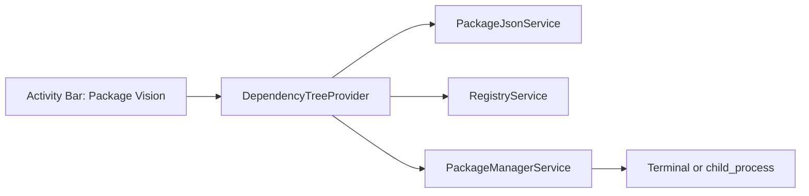

# 技术设计文档

## 1. 设计目标

这个扩展的技术设计要同时满足两件事：

- 对用户来说，依赖查看和升级动作要直观
- 对开发者来说，结构要清晰，适合新手逐步实现

因此第一版要优先选择 VS Code 原生能力，而不是一开始就堆复杂 UI。

## 2. 核心技术决策

### 2.1 使用桌面版 Node Extension，而不是 Web Extension

原因很直接：升级依赖需要执行本地包管理器命令，例如 `npm install react@latest`。Web Extension 运行在浏览器 Worker 环境中，无法创建子进程或运行可执行文件，因此不适合作为这个项目的第一实现目标。

### 2.2 使用 Activity Bar 自定义入口

你提到的“和搜索框、插件这些平级”，在 VS Code 里对应的是：

- `Activity Bar` 中的一个自定义 `View Container`

这意味着我们需要在扩展的 `package.json` 中使用：

- `contributes.viewsContainers.activitybar`
- `contributes.views`

### 2.3 使用 Tree View 作为第一版 UI

第一版建议使用 `Tree View`，理由是：

- 原生集成度高
- 风格和 VS Code 内置视图一致
- 适合分组展示依赖
- 对新手更容易上手
- 足以承载刷新、右键菜单、单包升级等操作

只有当你后面想做复杂筛选、版本对比卡片、图表或更自由的布局时，才建议升级到 `WebviewView`。

## 3. 总体架构



## 4. 推荐目录结构

建议在扩展初始化后逐步整理成下面的结构：

```text
package-vision/
  src/
    extension.ts
    commands/
      refreshDependencies.ts
      upgradeDependency.ts
    models/
      dependency.ts
    services/
      packageJsonService.ts
      registryService.ts
      packageManagerService.ts
      workspaceService.ts
    views/
      dependencyTreeProvider.ts
      treeItems.ts
    utils/
      semver.ts
      errors.ts
  resources/
    package-vision.svg
  docs/
    product-requirements.md
    technical-design.md
    development-workflow.md
```

你不需要一开始就把所有文件都建出来，但这个结构可以帮助你在实现过程中不把所有逻辑都塞进 `extension.ts`。

## 5. 模块职责

### 5.1 `extension.ts`

负责：

- 扩展激活入口
- 注册 Tree View Provider
- 注册命令
- 初始化共享服务

不要负责：

- 直接解析 `package.json`
- 直接请求 registry
- 直接拼接所有 UI 文案

### 5.2 `workspaceService.ts`

负责：

- 获取当前工作区根路径
- 判断是否存在 `package.json`
- 后续可扩展为识别多包项目

### 5.3 `packageJsonService.ts`

负责：

- 读取并解析 `package.json`
- 提取 `dependencies`、`devDependencies`
- 返回统一的数据结构

### 5.4 `registryService.ts`

负责：

- 根据包名查询最新版本
- 处理请求失败、超时、缓存
- 控制并发，避免一次打太多请求

### 5.5 `packageManagerService.ts`

负责：

- 识别项目包管理器
- 生成升级命令
- 执行升级命令
- 返回执行结果

### 5.6 `dependencyTreeProvider.ts`

负责：

- 将依赖数据转换成 Tree Item
- 管理刷新
- 提供空状态提示
- 与命令层联动

## 6. 数据模型建议

```ts
export type DependencySection =
  | 'dependencies'
  | 'devDependencies'
  | 'peerDependencies'
  | 'optionalDependencies';

export interface DependencyRecord {
  name: string;
  section: DependencySection;
  declaredVersion: string;
  latestVersion?: string;
  status: 'unknown' | 'upToDate' | 'outdated' | 'error';
  packageManager: 'npm' | 'pnpm' | 'yarn' | 'bun' | 'unknown';
}
```

第一版就算只用到其中一部分字段，也建议一开始把模型稍微设计完整一点，后面扩展会省很多事。

## 7. 激活与数据流

推荐数据流如下：

1. 用户点击 Activity Bar 中的 `Package Vision`
2. VS Code 激活扩展
3. 扩展检查当前工作区是否存在 `package.json`
4. 解析依赖列表
5. 查询每个依赖的最新版本
6. Tree View 渲染结果
7. 用户点击“升级”
8. 执行包管理器命令
9. 成功后刷新视图

## 8. 扩展清单中的关键贡献点

在 `package.json` 中，第一版重点会用到这些 contribution points：

- `contributes.viewsContainers.activitybar`
- `contributes.views`
- `contributes.commands`
- `contributes.menus`
- `contributes.configuration`
- `contributes.viewsWelcome`

### 8.1 视图容器

用于在 Activity Bar 增加一个新的入口。

### 8.2 视图

用于把依赖列表挂到这个容器里。

如果你的 `engines.vscode` 版本不低于 `1.74.0`，通常不需要再手动声明对应的 `onView:*` 激活事件；更老版本则要额外注意这个兼容点。

### 8.3 命令

用于刷新、升级、打开配置等操作。

### 8.4 菜单

用于把命令挂到：

- 视图标题工具栏
- Tree Item 右键菜单

### 8.5 配置项

用于后续扩展，例如：

- 是否显示 `devDependencies`
- 是否自动刷新
- 升级时是否保留 `^`

### 8.6 Welcome 内容

用于在视图为空时显示引导内容，例如：

- 没有打开工作区
- 没有找到 `package.json`
- 当前没有可展示的依赖

这比单纯显示空白树更友好，也更适合新手理解“为什么没有内容”。

## 9. UI 方案

### 9.1 视图结构

推荐结构：

- `Dependencies`
  - `react`
  - `react-dom`
- `Dev Dependencies`
  - `typescript`
  - `vite`

### 9.2 Tree Item 展示策略

分组项：

- `label` 使用分组名
- 可展示数量，例如 `(12)`

依赖项：

- `label`：包名
- `description`：声明版本，例如 `^18.3.1`
- `tooltip`：显示最新版本和状态
- `iconPath` 或 `resourceUri`：区分已过时和已最新

### 9.3 命令建议

- `packageVision.refresh`
- `packageVision.upgradeDependency`
- `packageVision.openPackageJson`
- `packageVision.copyInstallCommand`

第一版至少保证前两个。

## 10. 包管理器策略

### 10.1 识别规则

建议通过锁文件判断：

- `pnpm-lock.yaml` -> `pnpm`
- `yarn.lock` -> `yarn`
- `package-lock.json` -> `npm`
- 其他 -> `unknown`

### 10.2 MVP 建议

虽然可以识别多个包管理器，但第一版的执行策略建议更保守：

- 如果识别为 npm，则允许直接升级
- 如果识别为其他包管理器，则先提示“已识别，但暂未支持自动升级”

这样你既能把架构留好，也能降低第一版实现难度。

### 10.3 升级命令示例

- npm：`npm install <pkg>@latest`
- pnpm：`pnpm up <pkg>@latest`
- yarn classic：`yarn add <pkg>@latest`

注意：不同管理器对 `dependencies` 和 `devDependencies` 的写回行为不同，后续要进一步细化。

## 11. 最新版本获取策略

推荐第一版直接查询 npm registry，而不是调用 `npm outdated`：

- 更容易拿到结构化数据
- 不依赖本地 CLI 输出格式
- 更容易做缓存和错误处理

建议实现细节：

- 使用 HTTPS 请求 registry
- 设置超时
- 对同一轮请求做并发限制
- 为短时间内重复查询加缓存

## 12. 错误处理设计

至少要覆盖这些情况：

- 当前没有打开工作区
- 工作区没有 `package.json`
- `package.json` 解析失败
- 网络失败
- registry 返回异常
- 包管理器未安装
- 升级命令执行失败

建议错误展示方式：

- 轻量错误：`showWarningMessage`
- 阻塞错误：`showErrorMessage`
- 视图状态：Tree View 空状态文案

## 13. 性能设计

虽然第一版不需要过度优化，但最好提前做两个约束：

- 不要无限并发请求所有依赖
- 不要每次展开视图都重新请求全部版本

可采用的简单策略：

- 并发上限 5 到 10
- 缓存最近一次查询结果 1 到 5 分钟

## 14. 测试策略

### 14.1 单元测试

优先测纯逻辑：

- 解析 `package.json`
- 包管理器识别
- semver 状态判断
- 命令拼接

### 14.2 集成验证

在 Extension Development Host 中验证：

- 左侧入口是否出现
- 列表是否正确展示
- 升级命令是否正确执行
- 成功后是否自动刷新

## 15. 未来演进方向

当 Tree View 版本稳定后，可以考虑：

- 增加过滤和搜索
- 显示 `wanted` 版本
- 增加 changelog、npm 页面跳转
- 增加升级全部
- 升级到 `WebviewView` 做更丰富的界面

## 16. 对新手最重要的实现顺序

不要一开始就做“真实查询 + 升级命令 + 多包管理器”。更好的顺序是：

1. Activity Bar 入口
2. Tree View 假数据
3. 读取真实 `package.json`
4. 查询最新版本
5. 单包升级
6. 错误处理和测试

这会让你每一步都能看到清晰成果，也更适合积累 VS Code 扩展开发经验。

## 17. 参考资料

- [Your First Extension](https://code.visualstudio.com/api/get-started/your-first-extension)
- [Tree View API](https://code.visualstudio.com/api/extension-guides/tree-view)
- [Contribution Points](https://code.visualstudio.com/api/references/contribution-points)
- [Views UX Guidelines](https://code.visualstudio.com/api/ux-guidelines/views)
- [Activity Bar UX Guidelines](https://code.visualstudio.com/api/ux-guidelines/activity-bar)
- [Web Extensions](https://code.visualstudio.com/api/extension-guides/web-extensions)
